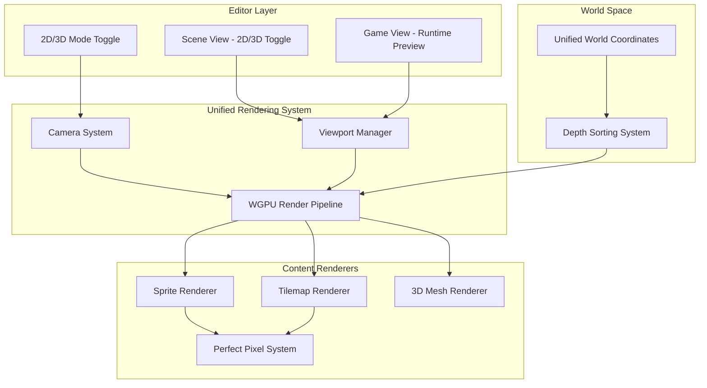

# Design Document: Unified 2D/3D Rendering System

## Overview

This design implements a Unity-like 2D/3D mode system that unifies rendering through WGPU, enabling seamless integration of 2D sprites and tilemaps with 3D content in a shared world space. The system provides perfect pixel rendering for 2D content while maintaining full 3D capabilities, with editor mode switching and consistent rendering between editor and runtime views.

The core innovation is using a single WGPU rendering pipeline that can handle both 2D and 3D content simultaneously, with camera projection modes determining the viewing perspective rather than separate rendering paths.

## Architecture

### High-Level Architecture



### Rendering Pipeline Flow

1. **Mode Detection**: Determine if current view is 2D or 3D mode
2. **Camera Setup**: Configure projection matrix (orthographic vs perspective)
3. **Content Gathering**: Collect all renderable objects in world space
4. **Depth Sorting**: Sort objects by depth for proper rendering order
5. **Batch Rendering**: Group similar objects for efficient WGPU calls
6. **Perfect Pixel Processing**: Apply pixel-perfect transformations for 2D content
7. **Final Composition**: Render to target (Scene View or Game View)

## Components and Interfaces

### Core Components

#### ViewMode Enum
```rust
#[derive(Debug, Clone, Copy, PartialEq)]
pub enum ViewMode {
    Mode2D,
    Mode3D,
}
```

#### UnifiedCamera Component
```rust
#[derive(Debug, Clone)]
pub struct UnifiedCamera {
    pub view_mode: ViewMode,
    pub projection: CameraProjection, // Existing: Orthographic/Perspective
    pub perfect_pixel_enabled: bool,
    pub pixel_snap_threshold: f32,
    
    // 2D Mode Settings
    pub orthographic_size: f32,
    pub pixels_per_unit: f32,
    
    // 3D Mode Settings  
    pub fov: f32,
    pub near_clip: f32,
    pub far_clip: f32,
    
    // Transition Settings
    pub smooth_transition: bool,
    pub transition_speed: f32,
}
```

#### PerfectPixelSettings Component
```rust
#[derive(Debug, Clone)]
pub struct PerfectPixelSettings {
    pub enabled: bool,
    pub snap_to_pixel: bool,
    pub filter_mode: FilterMode, // Nearest/Linear
    pub pixels_per_unit: f32,
    pub reference_resolution: (u32, u32),
}

#[derive(Debug, Clone, Copy)]
pub enum FilterMode {
    Nearest,  // For pixel-perfect
    Linear,   // For smooth scaling
}
```

#### Enhanced Sprite Component
```rust
#[derive(Debug, Clone)]
pub struct UnifiedSprite {
    pub texture_id: String,
    pub width: f32,
    pub height: f32,
    pub color: [f32; 4],
    
    // 2D/3D Rendering Options
    pub billboard: bool,           // Face camera in 3D mode
    pub world_space_ui: bool,      // Render as world space UI
    pub pixel_perfect: bool,       // Enable perfect pixel rendering
    pub sort_order: i32,          // Manual depth sorting
    
    // Perfect Pixel Settings
    pub pixels_per_unit: Option<f32>, // Override global setting
}
```

#### Enhanced Tilemap Component
```rust
#[derive(Debug, Clone)]
pub struct UnifiedTilemap {
    pub tileset: TileSet,
    pub tiles: HashMap<(i32, i32), TileData>,
    pub chunk_size: (u32, u32),
    
    // 2D/3D Rendering
    pub layer_depth: f32,
    pub pixel_perfect: bool,
    pub world_space_scale: f32,
    
    // Perfect Pixel Settings
    pub pixels_per_unit: Option<f32>,
    pub tile_size: (u32, u32), // In pixels
}
```

### System Interfaces

#### ViewModeManager
```rust
pub trait ViewModeManager {
    fn set_view_mode(&mut self, mode: ViewMode);
    fn get_view_mode(&self) -> ViewMode;
    fn toggle_view_mode(&mut self);
    fn is_transitioning(&self) -> bool;
}
```

#### PerfectPixelRenderer
```rust
pub trait PerfectPixelRenderer {
    fn snap_to_pixel(&self, position: Vec3, pixels_per_unit: f32) -> Vec3;
    fn calculate_pixel_scale(&self, world_scale: Vec3, pixels_per_unit: f32) -> Vec3;
    fn should_use_nearest_filter(&self, scale: Vec3) -> bool;
}
```

#### UnifiedRenderPipeline
```rust
pub trait UnifiedRenderPipeline {
    fn render_2d_content(&mut self, camera: &UnifiedCamera, viewport: &Viewport);
    fn render_3d_content(&mut self, camera: &UnifiedCamera, viewport: &Viewport);
    fn render_mixed_content(&mut self, camera: &UnifiedCamera, viewport: &Viewport);
    fn apply_perfect_pixel(&mut self, settings: &PerfectPixelSettings);
}
```

## Data Models

### Viewport Configuration
```rust
#[derive(Debug, Clone)]
pub struct Viewport {
    pub rect: Rect,              // Screen rectangle
    pub size: (u32, u32),        // Pixel dimensions
    pub scale_factor: f32,       // DPI scaling
    pub view_mode: ViewMode,     // Current mode
    pub target_texture: Option<wgpu::Texture>, // Render target
}
```

### Render Context
```rust
#[derive(Debug)]
pub struct UnifiedRenderContext {
    pub device: wgpu::Device,
    pub queue: wgpu::Queue,
    pub camera_binding: CameraBinding,
    pub view_mode: ViewMode,
    pub perfect_pixel_settings: PerfectPixelSettings,
    pub viewport: Viewport,
}
```

### Perfect Pixel Transform
```rust
#[derive(Debug, Clone)]
pub struct PixelPerfectTransform {
    pub world_position: Vec3,
    pub snapped_position: Vec3,
    pub pixel_scale: Vec3,
    pub pixels_per_unit: f32,
}
```

## Correctness Properties

*A property is a characteristic or behavior that should hold true across all valid executions of a system-essentially, a formal statement about what the system should do. Properties serve as the bridge between human-readable specifications and machine-verifiable correctness guarantees.*

### Property Reflection

After reviewing all properties identified in the prework, several redundancies and consolidation opportunities were identified:

**Redundancy Analysis:**
- Properties 1.2 and 1.3 (orthographic/perspective projection) can be combined into one comprehensive projection mode property
- Properties 2.2 and 3.2 (perfect pixel rendering in 2D mode) are essentially the same behavior applied to different content types - can be unified
- Properties 4.1 and 4.2 (pixel-perfect alignment) overlap significantly and can be consolidated
- Properties 5.2 and 5.3 (shader selection) can be combined into one property about appropriate shader usage
- Properties 6.1 and 6.3 (rendering consistency between views) are testing the same fundamental behavior

**Consolidation Decisions:**
- Combine projection mode properties into one comprehensive property
- Unify perfect pixel rendering properties across content types
- Merge shader selection properties
- Consolidate view consistency properties
- Keep depth sorting properties separate as they test different aspects (sprites vs tilemaps vs mixed content)

Based on this analysis, the following properties provide unique validation value:

Property 1: Mode toggle switches projection correctly
*For any* camera state, toggling between 2D and 3D modes should correctly switch between orthographic and perspective projections while preserving object positions
**Validates: Requirements 1.1, 1.2, 1.3, 1.4**

Property 2: Unified world space positioning
*For any* mix of 2D and 3D objects, all objects should be positioned in the same world coordinate system regardless of view mode
**Validates: Requirements 1.5, 2.1, 3.1**

Property 3: Perfect pixel rendering in 2D mode
*For any* 2D content (sprites and tilemaps), when in 2D mode, all content should render with pixel-perfect alignment and snap to pixel boundaries
**Validates: Requirements 2.2, 3.2, 4.1, 4.2**

Property 4: 3D mode rendering behavior
*For any* content in 3D mode, sprites should render as billboards or world-space quads based on configuration, and tilemaps should render as world-space geometry
**Validates: Requirements 2.3, 3.3**

Property 5: Depth sorting consistency
*For any* scene with mixed content at various depths, the rendering order should be correct using the depth buffer for both sprites and 3D objects
**Validates: Requirements 2.4, 3.4**

Property 6: Perfect pixel scaling preservation
*For any* 2D content scaled at integer factors, perfect pixel rendering should maintain crisp edges and use nearest-neighbor filtering
**Validates: Requirements 2.5, 4.3**

Property 7: Animation pixel preservation
*For any* animated tilemap tiles, texture coordinate updates should not affect perfect pixel rendering alignment
**Validates: Requirements 3.5**

Property 8: Viewport consistency
*For any* viewport size change, perfect pixel rendering should maintain consistent pixel ratios
**Validates: Requirements 4.4**

Property 9: Mixed content rendering
*For any* scene containing both 2D and 3D content, both types should render correctly in the same frame
**Validates: Requirements 4.5**

Property 10: Appropriate shader usage
*For any* content type, the system should use WGPU shaders optimized for that content (2D shaders for sprites/tilemaps, 3D shaders with lighting for meshes)
**Validates: Requirements 5.2, 5.3**

Property 11: Draw call batching
*For any* scene with multiple similar objects, the system should group them to minimize WGPU state changes
**Validates: Requirements 5.4**

Property 12: Texture management consistency
*For any* texture updates, both sprites and tilemaps should use the same WGPU texture management system
**Validates: Requirements 5.5**

Property 13: View rendering consistency
*For any* scene content, the Scene View and Game View should produce identical rendering output when using the same camera settings
**Validates: Requirements 6.1, 6.3**

Property 14: Gizmo isolation
*For any* scene with editor gizmos displayed, the gizmos should render without affecting game content
**Validates: Requirements 6.2**

Property 15: Mode transition consistency
*For any* switch between editor and play mode, visual quality should remain consistent
**Validates: Requirements 6.4**

Property 16: 2D navigation controls
*For any* 2D mode interaction, pan and zoom controls should work optimally for 2D navigation
**Validates: Requirements 7.1**

Property 17: 3D navigation controls
*For any* 3D mode interaction, orbit, pan, and zoom controls should work correctly for 3D navigation
**Validates: Requirements 7.2**

Property 18: Smooth mode transitions
*For any* mode switch, camera positions should transition smoothly to maintain context
**Validates: Requirements 7.3**

Property 19: Object framing
*For any* selected object, the framing function should adjust camera position to show the content optimally
**Validates: Requirements 7.4**

Property 20: Keyboard shortcut consistency
*For any* keyboard shortcut, the response should be consistent in both 2D and 3D modes
**Validates: Requirements 7.5**

## Error Handling

### Rendering Errors
- **Invalid Projection Matrix**: Fallback to default orthographic projection
- **Missing Texture Resources**: Use placeholder texture with error indication
- **WGPU Device Loss**: Attempt device recovery and reinitialize rendering pipeline
- **Shader Compilation Failure**: Fallback to basic unlit shader

### Mode Switching Errors
- **Camera State Corruption**: Reset to default camera position and settings
- **Viewport Size Invalid**: Clamp to minimum viable viewport dimensions
- **Transition Animation Failure**: Snap to target state immediately

### Perfect Pixel Errors
- **Invalid Pixels Per Unit**: Fallback to 100.0 (Unity standard)
- **Precision Loss**: Use double precision for critical calculations
- **Viewport Scaling Issues**: Maintain integer scaling ratios where possible

### Resource Management Errors
- **Texture Memory Exhaustion**: Implement texture streaming and LOD system
- **Buffer Overflow**: Dynamic buffer resizing with performance warnings
- **Batch Size Limits**: Split large batches into multiple draw calls

## Testing Strategy

### Dual Testing Approach

This system requires both unit testing and property-based testing to ensure correctness:

**Unit Testing Focus:**
- Specific camera projection calculations
- Perfect pixel snapping algorithms
- Mode transition edge cases
- WGPU resource management
- Shader compilation and binding
- Viewport calculations

**Property-Based Testing Focus:**
- Universal properties that should hold across all inputs using fast-check library
- Each property-based test will run a minimum of 100 iterations
- Properties will be tagged with comments referencing the design document
- Format: `**Feature: unified-2d-3d-rendering, Property {number}: {property_text}**`

**Testing Library Selection:**
For Rust, we will use the `proptest` crate for property-based testing, which provides:
- Arbitrary data generation for complex types
- Shrinking capabilities for minimal failing examples
- Integration with standard Rust testing framework
- Configurable test case generation

**Property Test Configuration:**
- Minimum 100 test cases per property
- Custom generators for camera states, viewport configurations, and content types
- Deterministic seeding for reproducible test runs
- Performance benchmarking for rendering operations

**Integration Testing:**
- End-to-end rendering pipeline tests
- Editor-runtime consistency verification
- Cross-platform rendering validation
- Performance regression testing