# Requirements Priority & Dependency Matrix

## Priority Levels

- **P0**: Critical - Must have for MVP
- **P1**: High - Important for production
- **P2**: Medium - Nice to have
- **P3**: Low - Future enhancement

## Effort Estimates

- **S** (Small): 1-2 weeks
- **M** (Medium): 3-4 weeks
- **L** (Large): 1-2 months
- **XL** (Extra Large): 2-3 months

---

## Requirements Matrix

| Req | Name | Priority | Effort | Phase | Dependencies |
|-----|------|----------|--------|-------|--------------|
| 1 | Plugin Architecture | P0 | XL | 1 | None |
| 2 | ECS System | P0 | XL | 1 | Req 1 |
| 3 | Physics System | P0 | L | 1 | Req 1, 2 |
| 4 | Rendering System | P0 | XL | 1 | Req 1, 2 |
| 5 | Audio System | P0 | L | 1 | Req 1 |
| 6 | Scripting System | P0 | L | 1 | Req 1, 2 |
| 7 | AI/LLM Core | P1 | XL | 2 | Req 2, 6 |
| 8 | Advanced Rendering | P1 | XL | 2 | Req 4 |
| 9 | Animation System | P1 | L | 2 | Req 2, 3, 4 |
| 10 | Destruction System | P2 | L | 3 | Req 3, 4 |
| 11 | Fluid Simulation | P2 | L | 3 | Req 3, 4 |
| 12 | Network Subsystem | P1 | XL | 2 | Req 2 |
| 13 | Asset Pipeline | P0 | L | 1 | Req 2 |
| 14 | Editor System | P0 | XL | 1 | Req 2, 4, 13 |
| 15 | CI/CD Pipeline | P0 | M | 1 | None |
| 16 | Version Control | P1 | M | 2 | Req 14 |
| 17 | Cloud Deployment (AWS) | P2 | L | 3 | Req 15, 18 |
| 18 | Docker Containerization | P1 | M | 2 | Req 15 |
| 19 | Kubernetes Orchestration | P2 | L | 3 | Req 18 |
| 20 | Cross-Platform Build | P0 | L | 1 | Req 15 |
| 21 | Profiling Tools | P1 | M | 2 | Req 2, 4 |
| 22 | Mobile Optimization | P1 | L | 2 | Req 4, 13 |
| 23 | Testing Framework | P0 | M | 1 | Req 2 |
| 24 | Documentation System | P1 | M | 4 | All |
| 25 | Plugin Marketplace | P2 | L | 4 | Req 1, 14 |
| 26 | Localization System | P1 | M | 2 | Req 14 |
| 27 | Accessibility Features | P1 | M | 3 | Req 6, 14 |
| 28 | Analytics & Telemetry | P2 | M | 3 | Req 12 |

---

## Phase Breakdown

### Phase 1: Foundation (Months 1-3) - P0 Requirements

| Req | Name | Effort | Team |
|-----|------|--------|------|
| 1 | Plugin Architecture | XL | 2 devs |
| 2 | ECS System | XL | 2 devs |
| 3 | Physics System | L | 1 dev |
| 4 | Rendering System | XL | 2 devs |
| 5 | Audio System | L | 1 dev |
| 6 | Scripting System | L | 1 dev |
| 13 | Asset Pipeline | L | 1 dev |
| 14 | Editor System | XL | 2 devs |
| 15 | CI/CD Pipeline | M | 1 dev |
| 20 | Cross-Platform Build | L | 1 dev |
| 23 | Testing Framework | M | 1 dev |

**Total Effort**: ~8 months (with 3-5 devs in parallel)

### Phase 2: Advanced Features (Months 4-6) - P1 Requirements

| Req | Name | Effort | Team |
|-----|------|--------|------|
| 7 | AI/LLM Core | XL | 2 devs |
| 8 | Advanced Rendering | XL | 2 devs |
| 9 | Animation System | L | 1 dev |
| 12 | Network Subsystem | XL | 2 devs |
| 16 | Version Control | M | 1 dev |
| 18 | Docker Containerization | M | 1 dev |
| 21 | Profiling Tools | M | 1 dev |
| 22 | Mobile Optimization | L | 1 dev |
| 26 | Localization System | M | 1 dev |

**Total Effort**: ~6 months (with 3-5 devs in parallel)

### Phase 3: Polish & Scale (Months 7-9) - P2 Requirements

| Req | Name | Effort | Team |
|-----|------|--------|------|
| 10 | Destruction System | L | 1 dev |
| 11 | Fluid Simulation | L | 1 dev |
| 17 | Cloud Deployment (AWS) | L | 1 dev |
| 19 | Kubernetes Orchestration | L | 1 dev |
| 27 | Accessibility Features | M | 1 dev |
| 28 | Analytics & Telemetry | M | 1 dev |

**Total Effort**: ~4 months (with 3-5 devs in parallel)

### Phase 4: Production Ready (Months 10-12)

| Req | Name | Effort | Team |
|-----|------|--------|------|
| 24 | Documentation System | M | 2 devs |
| 25 | Plugin Marketplace | L | 1 dev |
| - | Bug Fixes & Polish | L | All devs |
| - | Performance Optimization | M | All devs |

**Total Effort**: ~3 months (with 3-5 devs)

---

## Dependency Graph

```mermaid
graph TD
    %% Phase 1 - Foundation
    R1[Req 1: Plugin Architecture<br/>P0, XL, Phase 1]
    R2[Req 2: ECS System<br/>P0, XL, Phase 1]
    R3[Req 3: Physics System<br/>P0, L, Phase 1]
    R4[Req 4: Rendering System<br/>P0, XL, Phase 1]
    R5[Req 5: Audio System<br/>P0, L, Phase 1]
    R6[Req 6: Scripting System<br/>P0, L, Phase 1]
    R13[Req 13: Asset Pipeline<br/>P0, L, Phase 1]
    R14[Req 14: Editor System<br/>P0, XL, Phase 1]
    R15[Req 15: CI/CD Pipeline<br/>P0, M, Phase 1]
    R20[Req 20: Cross-Platform<br/>P0, L, Phase 1]
    R23[Req 23: Testing Framework<br/>P0, M, Phase 1]
    
    %% Phase 2 - Advanced
    R7[Req 7: AI/LLM Core<br/>P1, XL, Phase 2]
    R8[Req 8: Advanced Rendering<br/>P1, XL, Phase 2]
    R9[Req 9: Animation System<br/>P1, L, Phase 2]
    R12[Req 12: Network Subsystem<br/>P1, XL, Phase 2]
    R16[Req 16: Version Control<br/>P1, M, Phase 2]
    R18[Req 18: Docker<br/>P1, M, Phase 2]
    R21[Req 21: Profiling Tools<br/>P1, M, Phase 2]
    R22[Req 22: Mobile Optimization<br/>P1, L, Phase 2]
    R26[Req 26: Localization<br/>P1, M, Phase 2]
    
    %% Phase 3 - Polish
    R10[Req 10: Destruction<br/>P2, L, Phase 3]
    R11[Req 11: Fluid Simulation<br/>P2, L, Phase 3]
    R17[Req 17: Cloud AWS<br/>P2, L, Phase 3]
    R19[Req 19: Kubernetes<br/>P2, L, Phase 3]
    R27[Req 27: Accessibility<br/>P1, M, Phase 3]
    R28[Req 28: Analytics<br/>P2, M, Phase 3]
    
    %% Phase 4 - Production
    R24[Req 24: Documentation<br/>P1, M, Phase 4]
    R25[Req 25: Plugin Marketplace<br/>P2, L, Phase 4]
    
    %% Dependencies
    R1 --> R2
    R1 --> R3
    R1 --> R4
    R1 --> R5
    R1 --> R6
    R1 --> R25
    
    R2 --> R3
    R2 --> R6
    R2 --> R7
    R2 --> R9
    R2 --> R12
    R2 --> R13
    R2 --> R14
    R2 --> R21
    R2 --> R23
    
    R3 --> R9
    R3 --> R10
    R3 --> R11
    
    R4 --> R8
    R4 --> R9
    R4 --> R10
    R4 --> R11
    R4 --> R14
    R4 --> R21
    R4 --> R22
    
    R6 --> R7
    R6 --> R27
    
    R13 --> R14
    R13 --> R22
    
    R14 --> R16
    R14 --> R25
    R14 --> R26
    R14 --> R27
    
    R15 --> R17
    R15 --> R18
    R15 --> R20
    
    R18 --> R19
    R18 --> R17
    
    R12 --> R28
```



---

## Critical Path Analysis

### Longest Dependencies Chain:
```
Req 1 (Plugin) → Req 2 (ECS) → Req 14 (Editor) → Req 25 (Marketplace)
Total: XL + XL + XL + L = ~7 months
```

### Parallel Tracks:

**Track 1: Core Systems**
```
Req 1 → Req 2 → Req 3 → Req 9 → Req 10
(Plugin → ECS → Physics → Animation → Destruction)
```

**Track 2: Rendering**
```
Req 1 → Req 4 → Req 8 → Req 11
(Plugin → Rendering → Advanced → Fluid)
```

**Track 3: Tools**
```
Req 2 → Req 14 → Req 16 → Req 25
(ECS → Editor → VCS → Marketplace)
```

**Track 4: Infrastructure**
```
Req 15 → Req 18 → Req 19
(CI/CD → Docker → Kubernetes)
```

**Track 5: AI**
```
Req 2 → Req 6 → Req 7
(ECS → Scripting → AI/LLM)
```

---

## Resource Allocation

### Team Structure (3-5 developers)

**Core Team (3 devs minimum):**
- **Dev 1**: Plugin Architecture, ECS, Core Systems
- **Dev 2**: Rendering, Graphics, Shaders
- **Dev 3**: Editor, Tools, UI

**Extended Team (2 additional devs):**
- **Dev 4**: Physics, Animation, Advanced Features
- **Dev 5**: Network, Cloud, DevOps

### Skill Requirements

| Phase | Skills Needed |
|-------|---------------|
| **Phase 1** | Rust, ECS, Graphics (wgpu), UI (egui) |
| **Phase 2** | AI/ML, Networking, Mobile Dev |
| **Phase 3** | Cloud (AWS), DevOps (Docker/K8s) |
| **Phase 4** | Technical Writing, Community Management |

---

## Risk Mitigation

### High-Risk Requirements (XL effort)

| Req | Risk | Mitigation |
|-----|------|------------|
| 1 | Plugin architecture complexity | Prototype early, validate design |
| 2 | ECS performance | Benchmark multiple backends |
| 4 | Rendering complexity | Start with simple forward renderer |
| 7 | AI/LLM costs | Use caching, local models |
| 8 | Advanced rendering | Implement incrementally |
| 12 | Network reliability | Extensive testing, fallbacks |
| 14 | Editor stability | Continuous testing, autosave |

---

## Success Metrics

### Phase 1 (Foundation)
- ✅ All P0 requirements complete
- ✅ Can create simple 2D/3D game
- ✅ Editor functional
- ✅ CI/CD working
- ✅ 80%+ test coverage

### Phase 2 (Advanced)
- ✅ All P1 requirements complete
- ✅ AI features working
- ✅ Network multiplayer functional
- ✅ Mobile builds working
- ✅ Performance targets met

### Phase 3 (Polish)
- ✅ All P2 requirements complete
- ✅ Cloud deployment working
- ✅ Advanced features stable
- ✅ Accessibility compliant
- ✅ Production-ready

### Phase 4 (Production)
- ✅ Documentation complete
- ✅ Example projects published
- ✅ Community active
- ✅ First games released
- ✅ Positive feedback

---

**Total Estimated Timeline**: 12-18 months with 3-5 developers
**Total Estimated Cost**: $500K - $1M (assuming $100K/dev/year)
**Total Lines of Code**: ~100,000
**Total Requirements**: 28
