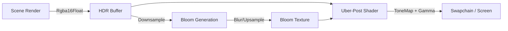

# 🎬 AAA Mobile Post-Processing Architecture: "Cinematic Stack"

**Objective**: Deliver "Console-Like" visual fidelity on mobile devices (iOS/Android) by implementing a high-performance, bandwidth-efficient HDR Post-Processing stack.

**Target**: 60 FPS on high-end mobile (Snapdragon 8 Gen 2 / A16 Bionic), scalable down to mid-range.

---

## 1. 🏗️ High-Level Architecture

The core philosophy for mobile post-processing is **Bandwidth Conservation**. Mobile GPUs (TBDR) suffer from heavy read/write costs.
We must avoid "Render Pass Hell" where every effect (Vignette, Noise, Grading) is a separate full-screen draw.

**The Strategy**:
1.  **Render Scene to HDR**: Draw the game world to an `Rgba16Float` texture.
2.  **Bloom Pass (Compute/Pyramid)**: Generate glow from bright areas.
3.  **Uber-Post Draw**: Combine *everything* else (ToneMap, Gradient, Vignette, Grain, AA) in **ONE** single final pass.

### Frame Flow


---

## 2. 🧱 Component Breakdown

### 2.1 HDR Rendering Infrastructure
Standard `Rgba8Unorm` is insufficient for cinematic lighting. We need high dynamic range logic.
*   **Format**: `wgpu::TextureFormat::Rgba16Float`.
    *   *Mobile Note*: `R11G11B10Float` is cheaper on bandwidth (32-bit vs 64-bit per pixel) but has no Alpha. If Alpha isn't needed for composition, prefer `R11G11B10Float` for 50% bandwidth saving!
    *   *Current Plan*: Start with `Rgba16Float` for compatibility, optimize to `R11G11B10Float` later.
*   **Usage**: All opaque and transparent geometry writes to this target.

### 2.2 🌸 Efficient Mobile Bloom
Standard Gaussian Blur is too heavy (requires many large kernel taps).
**Proposed Algorithm: Coarse Bloom (Dual Filter or Downsample/Upsample)**
1.  **Prefilter**: Threshold bright pixels (Luminance > 1.0) -> Write to Mip 0.
2.  **Downsample Chain**: 1/2 -> 1/4 -> 1/8 -> 1/16 resolution.
    *   Use **Bilinear Hardware Filtering** to blur for free during downsampling.
3.  **Upsample + Combine**: Add 1/16 -> 1/8 -> 1/4 -> 1/2 -> Final.
    *   Tent filter for smoother quality.
*   **Mobile Win**: Processing low-res buffers (e.g., 256x256) is incredibly fast even on old phones.

### 2.3 🎞️ The Uber-Shader (One Pass to Rule Them All)
This is the single Fragment Shader that writes to the Swapchain. It consolidates all "math-heavy" pixel operations that don't need neighbor pixels.

**Shader Logic (`post_process.wgsl`):**
```wgsl
@fragment
fn fs_main(in: VertexOutput) -> @location(0) vec4<f32> {
    // 1. Fetch HDR Color
    var color = textureSample(t_Scene, s_Scene, in.uv).rgb;

    // 2. Exposure Control (Auto-Exposure or Manual)
    color *= u_Exposure;

    // 3. Bloom Composite
    let bloom = textureSample(t_Bloom, s_Linear, in.uv).rgb;
    color += bloom * u_BloomIntensity;

    // 4. Cinematic Color Grading (ACES Style)
    // 4.1 Contrast / Saturation adjustment
    color = adjust_contrast_saturation(color);
    
    // 4.2 Color LUT (Look-Up Table) - Optional but powerful
    // color = apply_lut(color, t_Lut);

    // 5. Chromatic Aberration (Cheap version)
    // Shift R and B channels slightly based on distance from center
    // color.r = textureSample(t_Scene, s_Scene, uv + offset).r;

    // 6. Vignette
    let dist = distance(in.uv, vec2(0.5));
    color *= smoothstep(0.8, 0.2, dist * u_VignetteStrength);

    // 7. Tone Mapping (ACES Fitted) - CRITICAL for converting HDR to SDR
    color = aces_tone_map(color);

    // 8. Gamma Correction (Linear -> sRGB)
    // Hardware usually handles this if target format is sRGB, 
    // but explicit control is safer for stylization.
    return vec4<f32>(linear_to_srgb(color), 1.0);
}
```

**ACES Tone Mapping Function (Narkowicz fit):**
```wgsl
fn aces_tone_map(x: vec3<f32>) -> vec3<f32> {
    let a = 2.51;
    let b = 0.03;
    let c = 2.43;
    let d = 0.59;
    let e = 0.14;
    return saturate((x * (a * x + b)) / (x * (c * x + d) + e));
}
```

---

## 3. 🚦 Mobile Optimizations checklist

1.  **Precision**: Use `mediump` / `f16` inside the Uber-Shader. The eye cannot detect 32-bit precision differences in Tone Mapping.
2.  **LUT Size**: Use a small 3D LUT (16x16x16) for Color Grading. Linear filtering hides the low res.
3.  **Resolve on Chip**: If usage allows, resolve MSAA before this pass.
4.  **Avoid Dependent Texture Reads**: Calculate UVs in Vertex Shader or strictly linearly to help cache fetchers.

---

## 4. 📝 Implementation Tasks

### Phase 1: Infrastructure (Ready for Task 6.3.1)
- [ ] **RenderTarget**: Change `RenderModule` to create a `Rgba16Float` texture attachment alongside the Depth Buffer.
- [ ] **Pipeline**: Update `render_scene` to render into this offscreen texture instead of `surface_view`.

### Phase 2: The Uber-Shader (Ready for Task 6.3.2)
- [ ] **Shader**: Create `render/assets/shaders/post_process.wgsl`.
- [ ] **Renderer**: Create `PostProcessRenderer` struct.
    -   Needs a specific BindGroup for input textures (HDR Scene + Sampler).
    -   Needs a fullscreen triangle pass (no vertex buffer needed, generate via index).
- [ ] **Wiring**: In `render_system.rs`, after `mesh_renderer.render()`, call `post_process_renderer.render()`.

### Phase 3: Polish
- [ ] **Bloom**: Add the Downsample/Upsample passes before the Uber-Shader.
- [ ] **UI Integration**: Ensure UI is drawn **AFTER** Post-Processing (directly to Swapchain) so it remains crisp and unaffected by ToneMap/Bloom.
    -   *Correction*: Often UI is drawn on top of the Tonemapped buffer before presentation. 
    -   *Flow*: Scene -> HDR -> ToneMap -> SDR Buffer -> Render UI -> Swapchain.

---

**Result**: A visually rich, high-contrast image with glowing lights and cinematic falloff, running efficiently on mobile hardware.
