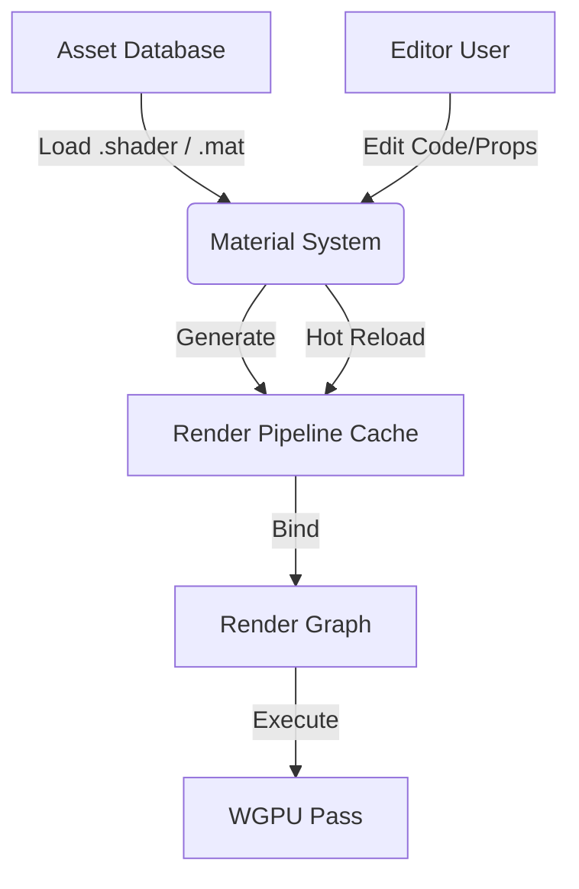

# 🏗️ Mobile-First Render Architecture (Data-Driven & Customizable)

เอกสารนี้เสนอโครงสร้าง Render Architecture ใหม่เพื่อรองรับ:
1.  **Multiple Workflows**: รองรับทั้ง Anime, PBR, Foliage, และ Custom Effects
2.  **Material Editor**: ปรับค่า Material และแก้ Shader Code แบบ Real-time
3.  **Mobile Optimized**: ยังคงประสิทธิภาพสูงสุดบนมือถือ (Static Branching @ Compile time)

---

## 1. Concept Overview: "Uber-Shader" vs "Shader Graph"

สำหรับ Mobile Engine ที่ต้องการความยืดหยุ่นแต่วิ่ง 60 FPS เราจะใช้ระบบ **Hybrid**:
*   **Core**: ใช้โครงสร้าง **Template-based Shader**
*   **Editor**: สร้าง Shader Variant จาก Data

### 📐 The Architecture



---

## 2. Implementation Modules

### 2.1 🎨 Material System (The "Asset" Layer)
เลิกใช้ `ToonMaterial` หรือ `PbrMaterial` ที่เป็น Struct ตายตัว เปลี่ยนเป็น **Generic Material**

**File Format (`.mat` JSON):**
```json
{
  "shader": "shaders/anime_character.wgsl",
  "pipeline_state": {
    "cull_mode": "Back",
    "blend": "AlphaBlending"
  },
  "properties": {
    "u_BaseColor": [1.0, 1.0, 1.0, 1.0],
    "u_OutlineWidth": 0.02,
    "t_MainTex": "textures/hero_d.png",
    "t_SDF": "textures/face_sdf.png"
  }
}
```

**Rust Implementation:**
```rust
pub struct Material {
    pub shader_id: AssetId,
    pub bind_group: wgpu::BindGroup, // Created dynamically based on shader layout
    pub properties: HashMap<String, UniformValue>,
}
```

### 2.2 🔮 Shader System (Real-time Compilation)
ให้ Engine อ่านไฟล์ `.wgsl` ดิบๆ และ "Inject" engine-params อัตโนมัติ

**User Shader Code (`custom_toon.wgsl`):**
```wgsl
// @binding(0) group(2) -> Auto-generated by Engine depending on metadata
// User just writes the logic

#import engine_scene // Include camera, lights, time

@fragment
fn fs_main(in: VertexOutput) -> @location(0) vec4<f32> {
    let N = normalize(in.normal);
    let L = engine_scene.main_light_dir;
    let ramp = textureSample(t_Ramp, s_Ramp, vec2(dot(N, L) * 0.5 + 0.5, 0.0));
    return ramp * u_BaseColor;
}
```

**Hot-Reloading System:**
1.  Editor: User แก้ไข text ในไฟล์ `.wgsl` -> Save
2.  FileWatcher: Detect change
3.  ShaderCompiler:
    *   Pre-process code (Resolve `#import`)
    *   Reflect Variables (หา Uniforms ที่ต้องใช้)
    *   Recreate `wgpu::RenderPipeline`
4.  MaterialSystem: Update material BindGroups ที่ใช้ Shader นี้ทั้งหมดทันที

---

## 3. 🕸️ Render Graph (Flexible Workflows)
เพื่อให้รองรับทั้ง `GodOfWarWind` (Compute) และ `AnimeOutline` (2-Pass) โดยไม่ต้องแก้ Code Rust บ่อยๆ

**Engine Config (`render_graph.yaml`):**
```yaml
passes:
  - name: "WindSimulation"
    type: "Compute"
    shader: "shaders/wind_sim.wgsl"
    frequency: "EveryOtherFrame" # Mobile optimization

  - name: "ShadowPass"
    type: "Raster"
    output: "DepthStencil"

  - name: "OpaquePass"
    type: "Raster"
    inputs: ["WindSimulation", "ShadowPass"] # Dependency
    draw: ["Opaque", "Cutout"]

  - name: "TransparentPass"
    type: "Raster"
    draw: ["Transparent"]
```

---

## 4. 📱 Mobile Specific Optimizations
เพื่อให้ระบบ Dynamic นี้ไม่กิน Spec:

1.  **Uber-Shader Macros:**
    *   ตอน Compile Shader ให้ใส่ `#define MOBILE_TIER_HIGH` หรือ `#define USE_INSTANCING` ลงไปใน shader string ก่อนส่งให้ WGPU
    *   ทำให้เรามี 1 Shader File แต่รันได้เหมาะสมทุก Device

2.  **Pipeline Caching:**
    *   Pipeline Creation บน WGPU แพงมาก (Compile async)
    *   Engine ต้อง Cache Pipeline ไว้ด้วย Hash ของ (ShaderCode + RenderState + Layout) ถ้า Hash เดิม ห้ามสร้างใหม่

3.  **BindGroup Frequency:**
    *   Group 0: Global (Camera, Time, Wind) - เปลี่ยน Frame ละครั้ง
    *   Group 1: Material (Textures, Props) - เปลี่ยนตาม Obj
    *   Group 2: Object (Transform) - เปลี่ยนทุก Obj (ใช้ Dynamic Offset ช่วย)

---

## 5. Workflow Example

1.  **Artist** เปิด Editor -> Create New Material -> เลือก Shader `Anime_Ultra.wgsl`
2.  **Shader Dev** เปิด Editor -> แก้ `Anime_Ultra.wgsl` เพิ่ม logic "Rim Light"
3.  กด Save -> จอ Game View กระพริบ 1 ที (Recompile Pipeline) -> เห็น Rim Light ทันที
4.  **Game Logic** อยากควบคุม Rim Light? -> `material.set_float("u_RimIntensity", 0.5)`

---

## ✅ Action Plan

1.  **Refactor `MeshRenderer`**: แยกส่วน `create_pipeline` ออกมาเป็น `ShaderManager`
2.  **Refactor `Material`**: เปลี่ยนจาก Struct ตายตัว เป็น `GenericMaterial` ที่ถือ `Buffer` ดิบ
3.  **Implement `FileWatcher`**: สำหรับ Hot-Reload .wgsl files
4.  **UI**: สร้าง Material Inspector ที่ Generate UI ตาม Uniform ที่เจอใน Shader
