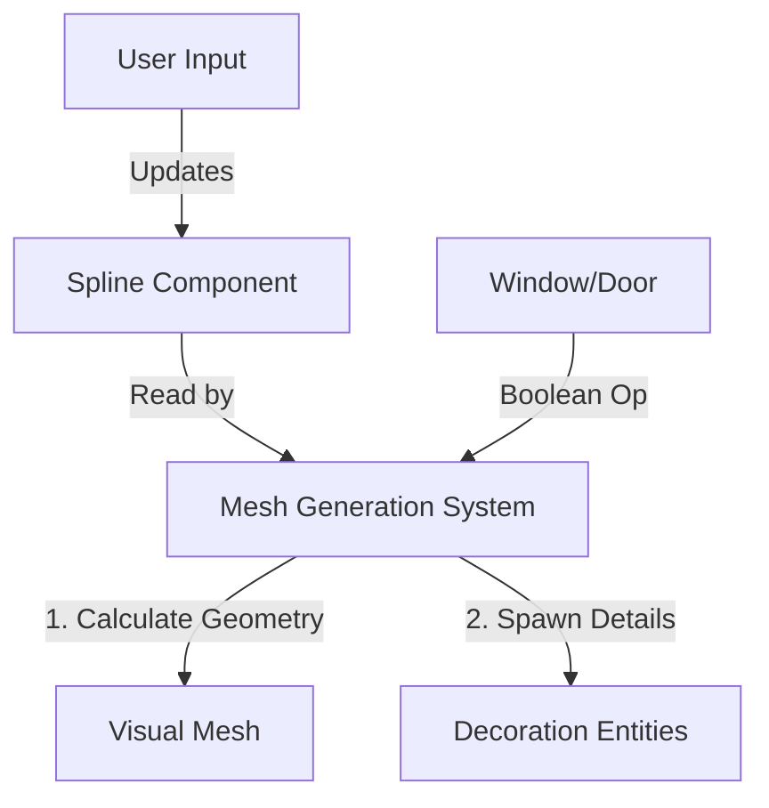

# Procedural Construction Tool Design ("Tiny Glade" Style)

## Overview
This document outlines the design for a **Procedural Building & Terrain Tool** inspired by *Tiny Glade*. The goal is to allow users to create complex, organic 3D environments by manipulating simple high-level constraints (splines, curves, volumes) rather than placing individual vertices or static meshes.

**Core Philosophy:** "The User sets the *Intent*, the Engine provides the *Detail*."

---

## 1. Core Architecture: The "Semantic" Layer

Unlike standard game objects where `Mesh` is static, here the visual mesh is **ephemeral**—generated effectively every frame (or on change) based on sematic data.

### 1.1 ECS Components
We introduce "Generator Components" that drive the mesh creation.

*   `ProceduralSpline`: A list of control points defining a curve (Bezier/Catmull-Rom).
    *   Used for: Walls, Fences, Paths, Streams.
*   `ProceduralVolume`: A defined 3D shape (Cylinder, Box, Primitive).
    *   Used for: Buildings, Towers.
*   `ModifierBrush`: A component defining an operation (Add, Subtract, Flatten).
    *   Used for: Windows (Subtraction from Wall), Doors, Terrain flattening.

### 1.2 The Generation Pipeline (System)

---

## 2. Key Features & Implementation

### 2.1 Spline-Based Wall Generation (The "Glade" Effect)
Walls in Tiny Glade adapt to terrain and allow curves.

*   **Implementation:**
    1.  **Curve Sampling:** Sample points along the spline at fixed intervals.
    2.  **Terrain Raycast:** Raycast down from each sample point to find the ground height.
    3.  **Mesh Extrusion:** Generate a "ribbon" mesh following the points, extruding upwards to `WallHeight`.
    4.  **UV Mapping:** Use "World Space UVs" or "Arc-Length Parametrization" so textures (bricks) flow continuously along the wall without stretching.

### 2.2 Boolean "subtract" (Windows & Doors)
Instead of CSG (Constructive Solid Geometry) which is slow and messy, use **Shader-Based Clipping** or **Mesh Retopology**.

*   **Technique (Mesh Retopology - Preferred for collision):**
    1.  When a "Window Entity" is placed near a "Wall Spline".
    2.  The Wall Generator detects the proximity.
    3.  It subdivides the wall mesh around the window's bounding box.
    4.  It removes the faces inside the window.
    5.  It spawns a "Window Frame" prefab in the hole.

### 2.3 Procedural Detail (WFC / Rules)
Details make it look "cozy".
*   **Roof Generation:**
    *   Detect closed loops of walls.
    *   Generate a "Straight Skeleton" or standard overhang mesh to create a roof.
    *   Spawn "Chimneys" or "Dormers" based on roof area.
*   **Decoration Rules (Ivy/Flowers):**
    *   *Rule:* "If wall normal is vertical and height < 1m, spawn grass."
    *   *Rule:* "If wall curvature is high, spawn vines."
    *   Use **Instanced Rendering** (WGPU) for thousands of leaves/bricks.

---

## 3. Editor Tooling (UX)

The UX is critical. It must feel "tactile".

### 3.1 The "Smart Cursor"
*   **Snapping:** Cursor snaps to Spline Control Points or Line Centers.
*   **Contextual Gizmos:**
    *   Hovering a wall top -> Show "Raise Height" arrow.
    *   Hovering a corner -> Show "Roundness" slider.

### 3.2 Interaction Modes
1.  **Draw Mode:** Click-drag to draw splines on terrain.
2.  **Paint Mode:** Spray details (flowers, pebbles) onto surfaces.
3.  **Tweak Mode:** Grab handles to reshape buildings.

---

## 4. Technical Stack (Rust/WGPU)

1.  **Spline Math:** Use `splines` or `glam` for Bezier evaluation.
2.  **Mesh Gen:** Use `half_edge` or custom dynamic mesh struct (Vertex/Index buffers).
3.  **WGPU:** Heavily leverage `InstancedMesh` for roof tiles and bricks. Do not merge them into one giant mesh; keep them instanced for memory efficiency.
4.  **Compute Shaders:** (Advanced) Use Compute Shaders to generate the wall geometry if CPU becomes a bottleneck.

## 5. Roadmap

- [ ] **Phase 1:** Basic Spline + Wall Mesh Generation (Dynamic Vertex Buffer).
- [ ] **Phase 2:** Terrain Snapping (Raycast integration).
- [ ] **Phase 3:** Boolean logic (Window holes).
- [ ] **Phase 4:** Roof Generation algorithm.
- [ ] **Phase 5:** "Juice" (Wobble animation on placement, sound effects).
